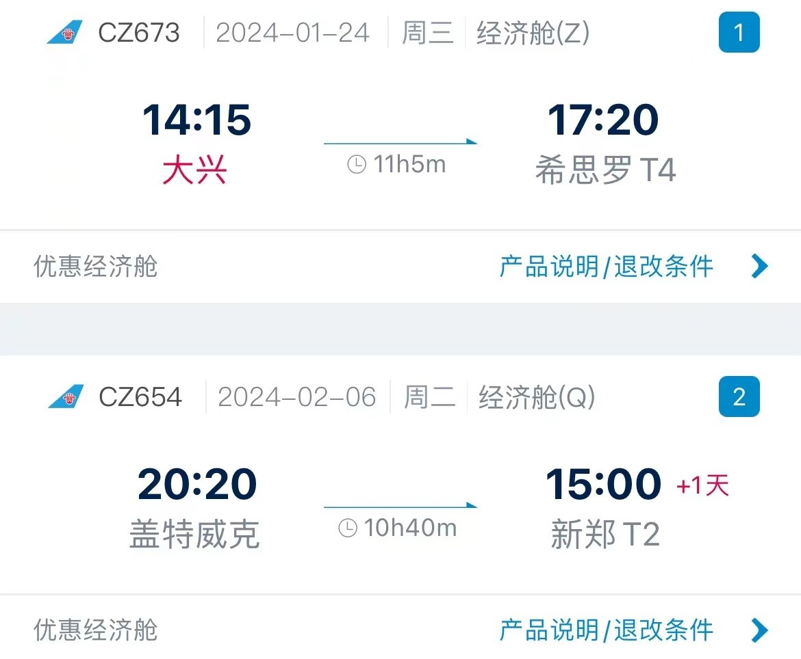

# 行程安排
[↩返回首页](README)

## 目录
- [行程安排](#行程安排)
  - [目录](#目录)
  - [住宿安排](#住宿安排)
  - [机票](#机票)
  - [每日行程](#每日行程)
    - [1月24日](#1月24日)
    - [1月25日](#1月25日)
    - [1月26日](#1月26日)
    - [1月27日](#1月27日)
    - [1月28日](#1月28日)
    - [1月29日](#1月29日)
    - [1月30日](#1月30日)
    - [1月31日](#1月31日)
      - [方案一：](#方案一)
      - [方案二：](#方案二)
    - [2月1日](#2月1日)
    - [2月2日](#2月2日)
    - [2月3日](#2月3日)
    - [2月4日](#2月4日)
    - [2月5日](#2月5日)
    - [2月6日](#2月6日)
    - [2月7日](#2月7日)
  - [推荐活动地](#推荐活动地)
    - [伦敦](#伦敦)
    - [牛津](#牛津)
    - [剑桥](#剑桥)
    - [曼彻斯特](#曼彻斯特)
---

## 住宿安排
- 1.24-1.31  
伦敦伯爵府宜必思酒店  
47 Lillie Rd, Earls Court,Hammersmith and Fulham,London  <iframe src="https://www.google.com/maps/embed?pb=!1m18!1m12!1m3!1d2484.4762393917104!2d-0.1997680714052696!3d51.48612756073566!2m3!1f0!2f0!3f0!3m2!1i1024!2i768!4f13.1!3m3!1m2!1s0x48760f8fd3493709%3A0xa6035cc2bedbf78f!2zNDcgTGlsbGllIFJkLCBMb25kb24gU1c2IDFVROiLseWbvQ!5e0!3m2!1szh-CN!2sus!4v1705839915893!5m2!1szh-CN!2sus" width="400" height="300" style="border:0;" allowfullscreen="" loading="lazy" referrerpolicy="no-referrer-when-downgrade"></iframe>

- 2.1-2.4  
曼彻斯特波特兰宜必思时尚酒店  
3-5 Portland Street, Piccadilly Gardens, Manchester <iframe src="https://www.google.com/maps/embed?pb=!1m18!1m12!1m3!1d826.6744988492674!2d-2.236152154564023!3d53.48031749856789!2m3!1f0!2f0!3f0!3m2!1i1024!2i768!4f13.1!3m3!1m2!1s0x487bb1bfab0b4673%3A0x8336426f76e99947!2s3-5%20Portland%20St%2C%20Piccadilly%2C%20Manchester%20M1%206DP%E8%8B%B1%E5%9B%BD!5e0!3m2!1szh-CN!2sus!4v1705840198338!5m2!1szh-CN!2sus" width="400" height="300" style="border:0;" allowfullscreen="" loading="lazy" referrerpolicy="no-referrer-when-downgrade"></iframe>

- 2.4-2.5
【待定】

## 机票

## 每日行程

### 1月24日
|时间|日程|
|----|----|
|17:20|抵达伦敦希思罗机场|
|19:00-20:00|机场-酒店|
|20:30后|休息、自由活动|

*	酒店附近交通：  Piccadilly line-伯爵府站、District line-Wimbledon、N  ational Express 503-London West Cromwell Road Tesco(Stop D)     

### 1月25日
|时间|日程|
|----|----|
|9:00-11:00| 酒店-牛津大学新学院 New College |
|11:00-12:00| 新学院中心游览|
|12:00-14:30| 午餐与自由参观|
|14:30-15:30| Prof.Palfreyman演讲   关于牛津大学、新学院与导师制|
|15:45-17:30| 学生自由交流   （牛津新学院-清华行健书院）|
|17:30-19:30| 返回伦敦|  

<iframe src="https://www.google.com/maps/embed?pb=!1m18!1m12!1m3!1d2469.80927441592!2d-1.2532035236998271!3d51.754811071870584!2m3!1f0!2f0!3f0!3m2!1i1024!2i768!4f13.1!3m3!1m2!1s0x4876c6a945b48709%3A0x490dd2b357d9e8bc!2z54mb5rSl5aSn5a245paw5a246Zmi!5e0!3m2!1szh-CN!2shk!4v1705856306856!5m2!1szh-CN!2shk" width="400" height="300" style="border:0;" allowfullscreen="" loading="lazy" referrerpolicy="no-referrer-when-downgrade"></iframe>

*   三餐：午餐在New Cellege，早餐、晚餐自行解决
*	交通：
	* 牛津：步行
    * 牛津返回伦敦：

### 1月26日

| 时间        | 日程             |
| ----------- | ---------------- |
| 9:00-11:30  | 酒店-克兰菲尔德大学 |
| 11:30-12:30 | 午餐             |
| 13:00-17:30 |                  |
| 17:30后     | 自由活动         |
<iframe src="https://www.google.com/maps/embed?pb=!1m18!1m12!1m3!1d2452.3126777922694!2d-0.6307806236782464!3d52.074037671947636!2m3!1f0!2f0!3f0!3m2!1i1024!2i768!4f13.1!3m3!1m2!1s0x4877ac4d48c8faeb%3A0x44c903e6bd92ce97!2z5YWL6Jit6I-y54i-5b635aSn5a24!5e0!3m2!1szh-CN!2shk!4v1705856407922!5m2!1szh-CN!2shk" width="400" height="300" style="border:0;" allowfullscreen="" loading="lazy" referrerpolicy="no-referrer-when-downgrade"></iframe>
*	三餐：自行解决
*	交通：

### 1月27日
| 时间        | 日程             |
| ----------- | ---------------- |
| 全天 | 休整与自由活动 |

### 1月28日

| 时间        | 日程       |
| ----------- | ---------- |
| 9:00-11:00  | 伦敦-剑桥   |
| 11:00-15:30 | 自由参观    |
| 15:30-15:45 | 欢迎和介绍仪式   |
| 15:45-16:10 | 课程培养方案分享   （清华大学-剑桥大学）|
| 16:20-17:00 | 主题开放讨论   工科生眼中的中英文化差异|
| 17:00-17:15 | 结束和感谢仪式 |
| 19:00-21:00 | Formal hall 晚餐与学院游览   （剑桥大学冈维尔与凯斯学院）|
| 21:00后 | 返回伦敦 |
<iframe src="https://www.google.com/maps/embed?pb=!1m18!1m12!1m3!1d2445.0930800051738!2d0.11059307633066794!3d52.20535597198038!2m3!1f0!2f0!3f0!3m2!1i1024!2i768!4f13.1!3m3!1m2!1s0x47d8774ed42712a9%3A0x21ca80abf36db5bb!2z5YqN5qmL5aSn5a24!5e0!3m2!1szh-CN!2shk!4v1705856450755!5m2!1szh-CN!2shk" width="400" height="300" style="border:0;" allowfullscreen="" loading="lazy" referrerpolicy="no-referrer-when-downgrade"></iframe>

<iframe src="https://www.google.com/maps/embed?pb=!1m18!1m12!1m3!1d2445.0751782198085!2d0.11294488969691029!3d52.20568129973427!2m3!1f0!2f0!3f0!3m2!1i1024!2i768!4f13.1!3m3!1m2!1s0x47d870bc22be2643%3A0x696d5f954d59315c!2sGonville%20%26%20Caius%20College%2C%20University%20of%20Cambridge!5e0!3m2!1szh-CN!2sus!4v1705899037188!5m2!1szh-CN!2sus" width="400" height="300" style="border:0;" allowfullscreen="" loading="lazy" referrerpolicy="no-referrer-when-downgrade"></iframe>

*	三餐：晚餐在剑桥大学，早、午餐自行解决
*	交通：

### 1月29日

| 时间        | 日程             |
| ----------- | ---------------- |
| 暂定15:00开始 | 伦敦大学学院（UCL） |
<iframe src="https://www.google.com/maps/embed?pb=!1m18!1m12!1m3!1d39718.10662586241!2d-0.21025775136717517!3d51.524559200000006!2m3!1f0!2f0!3f0!3m2!1i1024!2i768!4f13.1!3m3!1m2!1s0x48761b2f69173579%3A0xd008c67faecc133e!2z5YCr5pWm5aSn5a245a246Zmi!5e0!3m2!1szh-CN!2shk!4v1705856485584!5m2!1szh-CN!2shk" width="400" height="300" style="border:0;" allowfullscreen="" loading="lazy" referrerpolicy="no-referrer-when-downgrade"></iframe>

*	三餐：自行解决
*	交通：

### 1月30日

| 时间  | 日程               |
| ----- | ------------------ |
| 待定  | 清华自动化英国支队联谊 |

*	三餐：自行解决

### 1月31日
#### 方案一：  
| 时间        | 日程         |
| ----------- | ------------ |
| 9:00-11:00  | 伦敦-剑桥     |
| 11:30-13:00 | 午餐         |
| 待定 | 剑桥启迪科技园 |
| 18:00-20:00 | 返回伦敦     |
<iframe src="https://www.google.com/maps/embed?pb=!1m18!1m12!1m3!1d13822.659877137026!2d0.11910004913337496!3d52.233862882845045!2m3!1f0!2f0!3f0!3m2!1i1024!2i768!4f13.1!3m3!1m2!1s0x47d871b84dfe1473%3A0x927663a11dca4591!2sTusPark%20UK!5e0!3m2!1szh-CN!2shk!4v1705856724488!5m2!1szh-CN!2shk" width="400" height="300" style="border:0;" allowfullscreen="" loading="lazy" referrerpolicy="no-referrer-when-downgrade"></iframe>

#### 方案二：  
| 时间        | 日程         |
| ----------- | ------------ |
| 9:00-11:00  | 伦敦-剑桥     |
| 11:30-13:00 | 午餐         |
| 待定 | 剑桥清华校友交流 |
| 18:00-20:00 | 返回伦敦     |

*	三餐：自行解决

### 2月1日
| 时间  | 日程         |
| ----- | ------------ |
| 待定  | 伦敦-曼彻斯特 |

*	三餐：自行解决
*	酒店附近交通：

### 2月2日
| 时间        | 日程         |
| ----------- | ------------ |
| 8:45-9:00  | 酒店-曼彻斯特大学 |
| 9:00-15:30 | 曼彻斯特大学 （细节日程待定） |   

<iframe src="https://www.google.com/maps/embed?pb=!1m18!1m12!1m3!1d2375.0901031548574!2d-2.2364586235829136!3d53.466849772324444!2m3!1f0!2f0!3f0!3m2!1i1024!2i768!4f13.1!3m3!1m2!1s0x487bb18e8861a121%3A0x7cb93350c67efb3c!2z5pu85b655pav54m55aSn5a24!5e0!3m2!1szh-CN!2shk!4v1705856759171!5m2!1szh-CN!2shk" width="400" height="300" style="border:0;" allowfullscreen="" loading="lazy" referrerpolicy="no-referrer-when-downgrade"></iframe>

*	三餐：自行解决
*	回程交通：

### 2月3日
| 时间        | 日程             |
| ----------- | ---------------- |
| 全天 | 休整与自由活动 |

### 2月4日
| 时间        | 日程             |
| ----------- | ---------------- |
| 全天 | 休整与自由活动 |

### 2月5日
| 时间  | 日程         |
| ----- | ------------ |
| 待定  | 曼彻斯特-伦敦 |

*	三餐：自行解决

### 2月6日
| 时间        | 日程             |
| ----------- | ---------------- |
| 15:30-16:30 | 酒店-伦敦盖特威克机场 |
| 20:20       | 起飞             |

### 2月7日
| 时间  | 日程     |
| ----- | -------- |
| 15:00 | 抵达郑州新郑机场 |

---
## 推荐活动地
#### 注：若外出或自由活动务必报备并结伴同行， **严禁单独行动**。
### 伦敦
*	国家美术馆：上午10时至下午6时开放，建议提前官网预约不用排队。地铁站：Charing Cross, Leicester Square。
 * 大本钟：搭乘地铁Circle、District、Jubilee线至Westminster站下车，再步行约1分钟即到。
 *	伦敦眼：建议提前官网购票，摩天轮约30分钟。
*	威斯敏斯特教堂：周六开放时间9:00-13:00，需网上买票。
 *	海德公园：地铁 Piccadilly 线 Hyde Park Corner 站、 Knightsbridge 站。
  * 自然史博物馆 ：10:00-17：50 欧洲最大的自然博物馆，挨着海德公园
*	圣保罗大教堂：开放时间8:30-16:30，提前官网买票，地铁St. Paul's站。
*	千禧桥：哈利波特取景地之一。
*	伦敦塔桥
*	大英博物馆：开放时间10:00-17:00，免费入场。地铁Northern Line或Central Line，Tottenham Court Road站或Piccadilly Line或Central Line霍本站（Holborn）。
* 伦敦地牢10:00~16:00 带有历史气质的鬼屋
* 格林尼治皇家天文台 10:00~17:00
 * 白金汉宫 目前不开放
 * 大英图书馆 9:30~18:00
 * 泰特现代艺术馆 10:00~18:00 由发电厂改造
 * 杜莎夫人蜡像馆 10:00~15:00  
 * 维多利亚和阿尔伯特博物馆 10:00~17：45 
 * 查令十字街 各种书店
 ### 牛津
 * 牛津大学基督教堂学院Christ Church，哈利波特餐厅、教学楼取景地。
* 牛津大学自然史博物馆Oxford university museum of natural history，成立于1860年，哥德复兴式建筑，是牛津大学收集和陈列自然史标本的大学博物馆。
*	叹息桥Bridge Of Sighs，建于1914年，形似意大利威尼斯的叹息桥，故被称叹息桥。
 * 博德利图书馆 Bodleian Library，是哈利波特取景地之一，英国第二大图书馆。 
 *	拉德克利夫拱形建筑物Radcliffe camera，牛津标志性建筑之一。 
 *	圣母玛利亚大学教堂St. Mary University Church，位于牛津高街（High St）北边，拉德克利夫科学图书馆附近，可以登顶看牛津全景。
 *	市区小镇，有很多纪念品店。
 *	Oxford's covered market：室内小吃街，里面有著名的中餐小馆“牛津食堂”。
### 剑桥
*	国王学院
  *	牛顿桥
 *	圣体钟
  *	牛顿苹果树
 *	剑桥集市
 ### 曼彻斯特
  * 约翰·莱兰兹图书馆 10:00~17:00
 * 曼彻斯特市政厅 9:00~17:00
 * 科学与工业博物馆 10:00~17:00
  * 曼彻斯特博物馆 10:00~17:00
 * 曼彻斯特大教堂 9:30~16:00
 * 曼彻斯特美术馆 10:00~17:00
 * 帝国战争博物馆北方馆 10:00~17:00 在老特拉福德对面
 * 宫殿剧院12:00~16:00 17:00~22:00